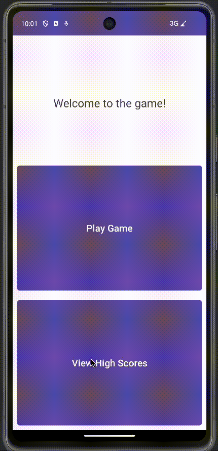

# MidtermApp

Random number guessing game.

## Functionality 

The following **required** functionality is completed:

* [ ] User sees a home screen, game screen, and high score screen.
* [ ] User can navigate between the game and high score screen, guess the random number.

The following **extensions** are implemented:

* Room Library
* Navigation
* Live Data
* Safe Args

## Video Walkthrough

## Notes

Setting up the project to work horizontally and vertically was difficult. 

## License

    Copyright 2023 Alex LaPointe.

    Licensed under the Apache License, Version 2.0 (the "License");
    you may not use this file except in compliance with the License.
    You may obtain a copy of the License at

        http://www.apache.org/licenses/LICENSE-2.0

    Unless required by applicable law or agreed to in writing, software
    distributed under the License is distributed on an "AS IS" BASIS,
    WITHOUT WARRANTIES OR CONDITIONS OF ANY KIND, either express or implied.
    See the License for the specific language governing permissions and
    limitations under the License.
